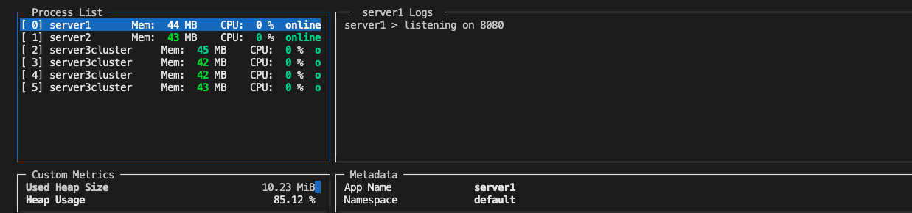
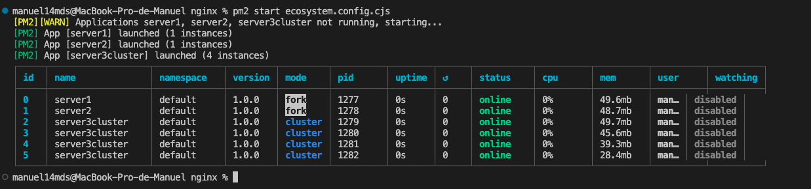
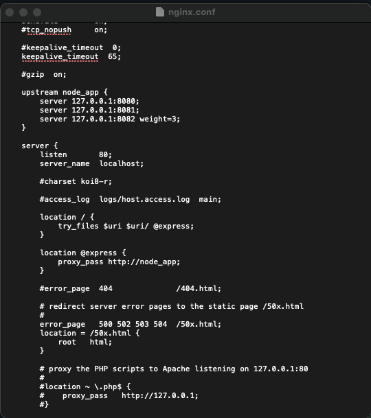
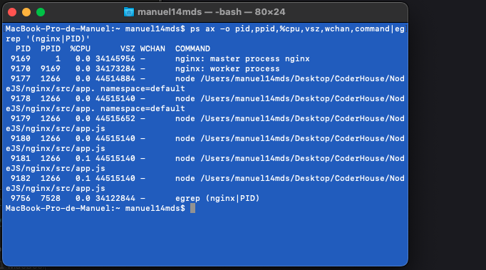
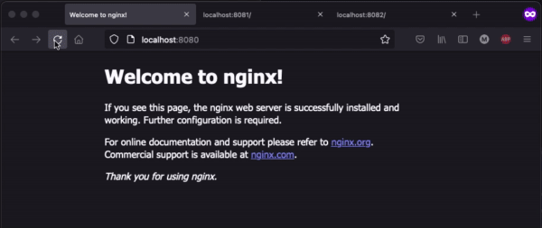

### Desafio: Servidor con balance de carga
Proyecto con PM2 corriendo tres servers, uno de ellos forkeado/clusterizado

# agrego la evidencia de pm2 monit

## nginx configuracion, procesos y resultado en el navegador
# config

# running

# navegador

